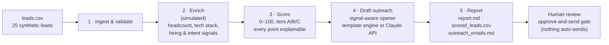

# AI Outreach Pipeline — Portfolio Demo

**What this is:** a working, end-to-end AI outreach pipeline I designed and built.
A CSV of leads goes in — enrichment, scoring, and personalized outreach drafts come out.
Built to demonstrate how I think about agentic AI systems: staged, explainable,
human-in-the-loop.

**Honest framing:** the 25 leads are synthetic (fictional people and companies —
see `demo/data/leads.csv`), and enrichment is a deterministic simulation. In
production, stages 2 and 4 call real APIs (Apollo-style enrichment, Claude for
drafting). The architecture, scoring rubric, and prompt design are the real
thing — that's what this demo is showing.

## Run it

```bash
bash demo/run.sh
```

Zero dependencies — Python 3 stdlib only. It prints each stage and writes to
`demo/output/`:

- `report.md` — tier distribution, top-10 leads, per-lead scoring reasons
- `scored_leads.csv` — every lead with score, tier, enrichment snapshot
- `outreach_emails.md` — a personalized draft per lead (nothing is sent)

Options: `bash demo/run.sh --min-score 55` to draft only for qualified leads.

Want live Claude drafting instead of the built-in template engine? Set
`ANTHROPIC_API_KEY` and `ANTHROPIC_MODEL` — the pipeline executes the exact
prompts in `demo/prompts.py` against the API and labels each draft accordingly.

## Architecture



## Project structure

```
demo/
├── run.sh              # one-command entry point
├── pipeline.py         # orchestrator: the 5 stages + CLI
├── prompts.py          # the actual prompt templates + scoring rubric
├── enrich.py           # stage 2 — deterministic simulated enrichment
├── scoring.py          # stage 3 — transparent 0–100 ICP scoring
├── drafting.py         # stage 4 — template engine + optional Claude API
├── data/leads.csv      # synthetic input (fictional, labeled as such)
└── output/             # generated: report.md, scored_leads.csv, outreach_emails.md
```

## Design choices worth knowing

- **Explainable scoring.** Every point has a reason string (`scoring.py`), so a
  human or a reviewer agent can audit why a lead is Tier A. Black-box scores
  don't survive contact with a sales team.
- **Prompts as code review.** The outreach prompts live in `prompts.py`, not
  buried in logic — same practice I use in production: prompts are versioned,
  reviewable artifacts.
- **Deterministic demo, live-capable core.** The template engine means anyone
  can run this with no keys; the Claude path uses the identical prompts, so what
  you see is what you'd get in production.
- **Human-in-the-loop by design.** The pipeline ends at drafts, not sends. The
  approve-and-send gate is a feature, not a missing piece.

## Related

- [`case-study.md`](case-study.md) — how I cut manual prospecting work 50% with
  a 12-agent AI system (sanitized production story, 2-minute read)
- [`loom-outline.md`](loom-outline.md) — 5-minute video walkthrough script

## Still to come

- [ ] Loom walkthrough recorded (script above)
- [ ] Agent design patterns — sanitized prompt-library/agent-config patterns (no employer IP)
- [ ] Public link for the resume (replace the `~/workspace/job-search/portfolio/` placeholder in `../resumes/`)
